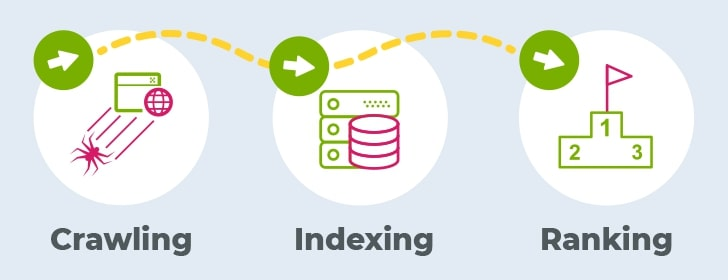
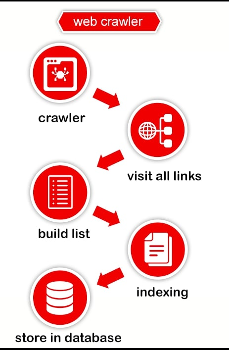

<h1 steyle="color:red;" >Search engine</h1>

<h1 align="center" style="color:black;"> <u> <b>Search engine</h1></u><b>

A search engine is an online tool or software program designed to help users find information on the Internet. 
  
It allows users to enter specific keywords, phrases, or questions related to their search query and provides a list of relevant websites, documents, images, videos, or other content that match the query.
  

Search engines use complex algorithms and web crawlers to scan and index vast amounts of information available on the web. They analyse various factors, such as keyword relevance, page quality, and user popularity, to determine the most relevant and useful results for a given search query. The results are typically presented in a ranked list, with the most relevant pages appearing higher in the list.

<h1 align="center" style="color:black;"> <u> <b>Some popular search engines include </h1></u><b><h1 align="center" style="color:yellow;">Google</h1>, <h1 align="center" style="color:red;">Bing</h1><h1 align="center" style="color:green;"> Yahoo</h1><h1 align="center" style="color:black;">  DuckDuckGo.</h1>

An estimated 70% to 80% of internet users use Google as a search Engine and 30% to 20% internet users use other search Engines.

<h1 align="center" style="color:black;"> <u> <b>How does a search engine work?</h1></u><b>

Search engines work through a process that involves crawling, indexing, and ranking

<h2 style="color:darkred;display:inline"><u>Crawling:</h2></u>

Crawling refers to following the links on a page to new pages, and continuing to find and follow links on new pages to other new pages.
   

<h2 style="color:black; display:inline"><u>Indexing:</h2></u>

Indexing is the process that stores information they find in an  index, a huge database of all the content they have discovered, and seems good enough to serve up to searches.
   

<h2 style="color:green; display:inline"><u>Ranking:</h2></u>

Google ranking algorithm takes more than 255 rules into account to rank a page.
  

<h1 align="center" style="color:black;"> <u> <b>Explain web crawler and a crawling?</h1></b></u>

</img>
<h2 style="color:darkred;display:inline"><u>Web crawling</h2></u>

Web crawling also known as web scraping or spidering, refers to the automated process of systematically browsing and extracting information from websites across the internet. It involves using software programs called web crawlers or spiders to navigate through web pages, following hyperlinks to discover and gather data from various sources.

<h2 style="color:darkred;"><u>A web crawler</h2> </u>

Web crawler or spider, is a type of bot that is typically operated by search engines like Google and Bing. Their purpose is to index the content of websites all across the Internet so that those websites can appear in search engine results.

<h1 align=center style="color:black;"><u><b>What is meant by “cached” while searching?</h1> </u><b>

When a search engine refers to a webpage as "cached," it means that the search engine has stored a copy of that webpage in its index or database. The cached version of a webpage is essentially a snapshot of the page taken by the search engine during its crawling process.

Search engines use caching as a way to provide faster access to web content and improve the user experience

 <h1 align=center style="color:black;"><u> <b>What's an organic result?</h1></u></b>

 
In the context of search engine results pages (SERPs), an organic result refers to the listing of web pages that appear naturally based on their relevance to the search query, as determined by the search engine's algorithms. Organic results   are distinct from paid advertisements or sponsored listings, which are typically marked as such and appear separately on the SERP.

 <h1 align="center" style="color:black;"><u><b>What's a paid result?</h1></u></b>

 
 Paid results typically appear at the top, bottom, or side of the search engine results page, separate from the organic (non-paid) listings. They are often marked as advertisements or labelled as sponsored content to distinguish them from organic results.

  <h1 align="center" style="color:black;"><b><u>What is meant by “bounce rate”?</h1></b></u>

  
Bounce rate is a metric that measures the percentage of website visitors who leave a webpage without taking any further action or navigating to other pages within the same website. In other words, it represents the percentage of single-page visits.

   
A high bounce rate generally indicates that visitors are not engaging or finding value on a webpage, while a low bounce rate suggests that visitors are exploring the website further and interacting with additional content.

<h1 align="center" style="color:black;"><b><u>What makes a website appear higher up in search results?</h1></b></u>

Several factors influence the ranking and positioning of a website in search engine results pages (SERPs). While the specific algorithms used by search engines are complex and constantly evolving, here are some key elements that generally impact a website's visibility and higher placement in search results.

<h1 style="color:darkred;"><u><b>Relevance: </h1></u></b>

Search engines aim to provide the most relevant results for a user's search query. Websites that closely match the intent and content relevance of a search query are more likely to appear higher in the results.

<h1 style="color:green;"><u><b>Content Quality: </h1></u></b>

High-quality, well-written, and informative content that satisfies user intent is valued by search engines. Websites with in-depth, original, and engaging content tend to rank higher.

<h1 align="center" style="color:black;"><b><u>How do your past search activity affect your search results?</h1></b></u>

Search engines take into account a user's search history to provide more personalised results.If you have searched for specific topics or clicked on certain types of content in the past, search engines may prioritise similar content or sources in your future search results.

Search engines may analyse your past search activity to infer your interests and preferences.

<h1 align="center" style="color:black;"><b><u>Are there any search engines that don't track your activity?</h1></b></u>

DuckDuckGo,
Startpage,
Swisscows, Qwant, Searx These search engines prioritise user privacy by minimising data collection, avoiding personalised tracking, and delivering more anonymous search experiences.

